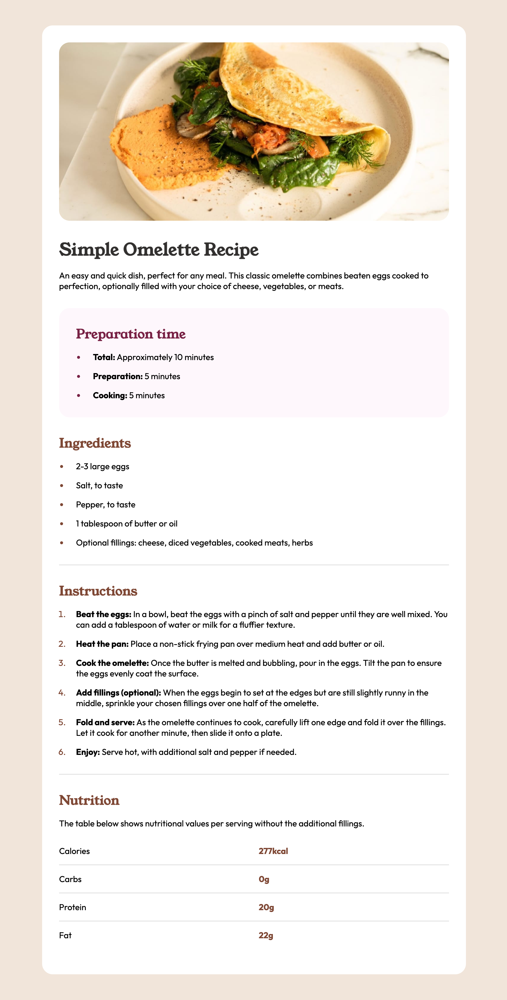
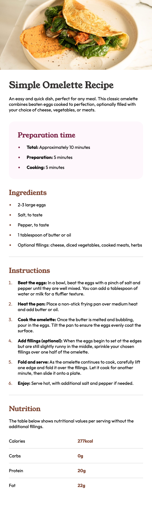

## Table of contents

- [Overview](#overview)
  - [Screenshot](#screenshot)
  - [Links](#links)
- [My process](#my-process)
  - [Built with](#built-with)
  - [What I learned](#what-i-learned)
  - [AI Collaboration](#ai-collaboration)

## Overview

### Screenshot

| Desktop | Mobile |
| ----------- | ----------- |
| |  |

### Links

- Solution URL: [GitHub](https://github.com/pshecko/recipe-page)
- Live Site URL: [Live page](https://pshecko.github.io/recipe-page/)

## My process

### Built with

- HTML
- CSS
- Visual Studio Code
- Chrome Dev Tools
- Claude Code

### What I learned

I learned some useful semantic HTML tags which didn't exist back when I wrote HTML code by hand last time, refreshed my memory of styling HTML backbone with CSS, got a more close understanding of CSS selectors and pseudo-selectors, used Chrome Dev Tools to check and perfect the alignment of elements on a page

### AI Collaboration

I used Claude Code (VS Code plugin) primarily for consulting with best practices, brainstorming ideas, troubleshooting and comparing alternative ways to tackle problems which had more than one possible way to solve.
